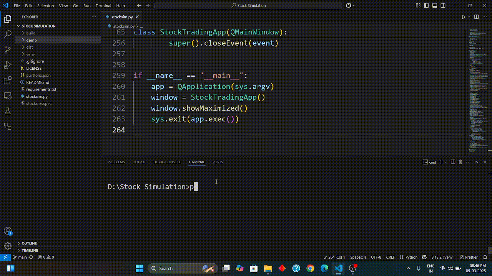

# Stock-Market-Simulation

## App UI



## How are stock prices generated Here

Stock prices are generated as Geometric Brownian Motion

The stochastic differential equation (SDE) for GBM is given by:

$$
dS_t = \mu S_t\,dt + \sigma S_t\,dW_t
$$

Where:

- **\(S_t\)**: Stock price at time \(t\)
- **\(\mu\)**: Drift coefficient (expected return)
- **\(\sigma\)**: Volatility coefficient (risk/uncertainty)
- **\(dt\)**: Infinitesimal time increment
- **\(dW_t\)**: Increment of a Wiener process (Brownian motion)

The solution to this SDE can be expressed as:

$$
S_t = S_0 \exp\left[\left(\mu - \frac{1}{2}\sigma^2\right)t + \sigma W_t\right]
$$

Where:

- **\(S_0\)**: Initial stock price
- **\(W_t\)**: Standard Brownian motion at time \(t\)

## Cloning the repository and working directory

```bash
git clone https://github.com/utkarshg1/Stock-Market-Simulation.git
```

## Change working Directory

```bash
cd Stock-Market-Simulation
```

## Create a python virtual environment

```bash
python -m venv venv
```

## Activate virtual environment

For windows
```cmd
venv\Scripts\activate
```

For Linux
```bash
source venv/bin/activate
```

## Upgrade pip

```bash
python -m pip install --upgrade pip
```

## Install requirements.txt

```bash
pip install -r reqirements.txt
```

## Running the app

```bash
python stocksim.py
```
